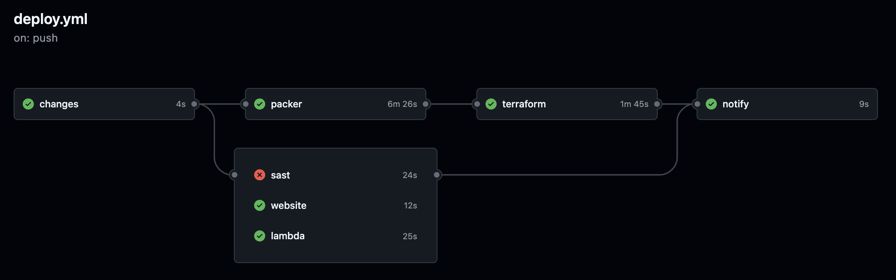

# AWS Deployment using GitHub Actions

## Prerequisites

### Set Github Actions Variables

1. Go to your GitHub repository.
2. Click on "Settings" > "Secrets and variables" > "Actions".
3. At Variables, click on "New repository variable".
4. Add the following variables:
    - `AWS_ACCOUNT_ID`: Account ID of the AWS Project you are creating resources in
    - `REGION`: ap-southeast-1
    - `AMI_PREFIX`: AMI name prefix to search for the most recent AMI built by Packer
    - `LAMBDA_NAME`: Name for your telegram bot lambda function
    - `S3_BUCKET_NAME`: Name for your S3 bucket that will contain the static website code
    - `PACKER_VPC_ID`: VPC ID of a temp vpc for your packer to run in
    - `PACKER_SUBNET_ID`: Subnet ID of a temp vpc for your packer to run in

### Set up GitHub OIDC Identity Provider in AWS

#### 1. Create Identity Provider

1. At AWS IAM console, go to Identity Providers: Add Provider
2. Provider Type: `OpenID Connect`
3. Provider URL: `https://token.actions.githubusercontent.com`
4. Audience: `sts.amazonaws.com`
5. Click "Add Provider"

#### 2. Create IAM Role

1. At AWS IAM console, go to Roles: Create Role
2. For "Custom trust policy" and add the policy json below after you substitute `YOUR_AWS_ACCOUNT_ID`, `YOUR_GITHUB_USER` and `YOUR_GITHUB_REPO` in the policy json:
3. For role, add `AdministratorAccess` policy for convenience, or find out the least privileges that your runners will need.
4. Click "Next", name the role (e.g., `GitHubActionsRole`), and create the role.

```json
{
    "Version": "2012-10-17",
    "Statement": [
        {
            "Effect": "Allow",
            "Principal": {
                "Federated": "arn:aws:iam::YOUR_AWS_ACCOUNT_ID:oidc-provider/token.actions.githubusercontent.com"
            },
            "Action": "sts:AssumeRoleWithWebIdentity",
            "Condition": {
                "StringEquals": {
                    "token.actions.githubusercontent.com:aud": "sts.amazonaws.com"
                },
                "StringLike": {
                    "token.actions.githubusercontent.com:sub": "repo:YOUR_GITHUB_USER/YOUR_GITHUB_REPO:ref:refs/*"
                }
            }
        }
    ]
}
```

#### 3. Use the AWS IAM Role in your Github workflow

In your GitHub Actions workflow yaml file, you can use the role you created above like this, where GitHubActionsRole is the name of the role you have created:

```yaml
permissions:
  id-token: write
  contents: read

  jobs:
    deploy:
      runs-on: ubuntu-latest
      steps:
        - name: Configure AWS credentials from OpenID Connect (OIDC)
          uses: aws-actions/configure-aws-credentials@v2
          with:
            role-to-assume: arn:aws:iam::${{ vars.AWS_ACCOUNT_ID }}:role/GitHubActionsRole
            aws-region: ${{ secrets.REGION }}
```

### Create Telegram Bot (Optional)

- This is to enable telegram notifications after workflow runs (final stage of workflow).

1. Chat with @BotFather on Telegram
2. Create a New Bot and obtain API Key (`TELEGRAM_BOT_TOKEN`)
3. Get your Telegram Chat ID by chatting with @RawDataBot (`TELEGRAM_CHAT_ID`)
4. Add these variables to your Github secrets: `TELEGRAM_CHAT_ID`, `TELEGRAM_BOT_TOKEN`

## Deployment

- The final working github workflow is contained in [deploy.yml](.github/workflows/deploy.yml)
- This workflow is triggered by tagged commits in the syntax of x.x.x, where x are numbers, e.g., 1.2.34

### Run git commands

```sh
git tag 1.0.0
git push --tags
```

### Observe Workflow

- Go to Github Repo > Actions
- The SAST job should fail because it has identified a supply-chain vulnerability in our Python Library (implanted on purpose)
- The remaining jobs should pass, if not, go into the failed jobs to troubleshoot them
- Below is an example of a successful workflow:
